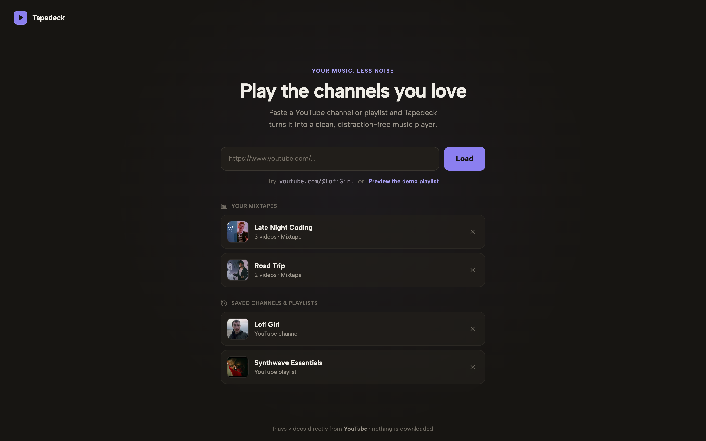

# Tapedeck

**Your queue, less noise.** Tapedeck is a lightweight desktop player that turns any YouTube channel or playlist into a focused, distraction-free queue — no comments, no recommendations, no rabbit holes.

[](https://github.com/MelodicDevelopment/tapedeck/actions/workflows/ci.yml)
[](LICENSE)
[](https://v2.tauri.app)
[](https://react.dev)
[](https://www.rust-lang.org)



Videos always play through the visible, official YouTube embedded player. Tapedeck never downloads or extracts anything — it is a *player*, not a downloader.

## Features

- **Paste a URL, get a queue** — channels (handles, IDs, legacy usernames), playlists, and YouTube Music links all resolve into a clean video queue
- **Mixtapes** — build your own playlists from videos across any channels; they play instantly and live entirely on your machine
- **Library** — every source you load is saved for one-click replay
- **Real player controls** — shuffle, repeat (playlist or single video), autoplay, and a queue that follows the playing track
- **OS integration** — hardware media keys (play/pause/next/previous), Now Playing metadata in the macOS Control Center, and background playback when the window is closed
- **Keyboard shortcuts** — Space to play/pause, arrow keys for volume
- **Privacy-respecting by design** — no Tapedeck account, no telemetry, no database; your Google login exists only to identify your account and optionally sync your library, and the refresh token lives in your OS credential vault

## Installation

There are no prebuilt releases yet — you build Tapedeck yourself (about two minutes once the toolchain is installed). Prebuilt, signed releases are on the roadmap.

### Prerequisites

- [Node.js](https://nodejs.org) 20 or newer
- [Rust](https://rustup.rs) stable
- Platform dependencies from the [Tauri setup guide](https://v2.tauri.app/start/prerequisites/)
- macOS packaging additionally requires Xcode 26+ (for the icon catalog)
- A Google OAuth **Desktop app** client (free — see [Google Cloud setup](#google-cloud-setup))

### Build and run

```sh
git clone https://github.com/MelodicDevelopment/tapedeck.git
cd tapedeck
cp .env.example .env   # add your Google OAuth client ID + secret + YouTube API key
npm install
npm run desktop        # development app
npm run desktop:build  # packaged .app / installer
```

The demo playlist works with zero configuration if you just want to see it run.

### Google Cloud setup

Sign-in uses your **own** OAuth client, so your usage is never mixed with anyone else's:

1. Create a [Google Cloud](https://console.cloud.google.com) project and enable **YouTube Data API v3**.
2. Configure the OAuth consent screen; add your Google account as a test user.
3. Create **Credentials → OAuth client ID → Desktop app**.
4. Create **Credentials → API key**, restricted to YouTube Data API v3.
5. Put these in `.env` as `TAPEDECK_GOOGLE_CLIENT_ID`, `TAPEDECK_GOOGLE_CLIENT_SECRET`, and `TAPEDECK_YOUTUBE_API_KEY`.

All three values are embedded at build time. Google requires the Desktop-app secret at the token endpoint even with PKCE and [documents installed-app secrets as non-confidential](https://developers.google.com/identity/protocols/oauth2#installed) — but keep `.env` out of source control regardless.

Tapedeck only ever reads public channel/playlist/video data, so YouTube access is a plain API key, not an OAuth scope. Sign-in requests `openid`, `email`, and `profile` to identify your account, plus `drive.appdata` if you enable library sync — nothing that can modify your YouTube account.

## How it works

| Layer | Choice | Why |
|---|---|---|
| Shell | Tauri 2 (Rust) | Uses the OS webview instead of bundling Chromium — small binary, low idle memory |
| UI | React + TypeScript + Vite | Fast iteration, typed end to end |
| Playback | YouTube IFrame Player API | Official, visible embed — compliant playback with ads/analytics intact |
| Data | YouTube Data API v3 | Called directly from the Rust host with a build-embedded API key (public data only, no user auth) |
| Auth | OAuth installed-app flow | System browser + PKCE + loopback callback + state validation |
| Secrets | OS credential vault | Refresh token in Keychain/Credential Manager; access tokens stay in memory |
| Storage | JSON in the app data dir | Library and mixtapes; no server, no accounts |

A few deliberate architecture points:

- The packaged UI is served from a locked-down localhost origin so the YouTube player receives ordinary HTTP client identity; a single-instance guard keeps that origin private.
- The webview is granted **only** Tapedeck's compiled commands — no general filesystem or shell access.
- DNS resolves in-process (system nameservers with public fallback) and Google/YouTube requests retry transparently, so flaky networks don't surface as broken sign-ins.
- An optional Express server (`npm run dev`) provides an API-key-based fallback for running Tapedeck as a plain browser app.

## Development

```sh
npm run desktop     # Tauri dev app (Vite + native window)
npm run dev         # browser app + Express API fallback
npm test            # Vitest + Testing Library
npm run lint        # ESLint
npm run typecheck   # tsc

cd src-tauri
cargo test
cargo fmt --check
cargo clippy --all-targets --all-features -- -D warnings
```

Project layout:

```text
src/                 React UI (components, lib = pure logic, api = Tauri/HTTP bridges)
src-tauri/src/       Rust host: auth, youtube, media (OS media keys), library, dns
server/              optional Express fallback for the browser build
```

## Contributing

Contributions are welcome — bug reports, features, docs, and platform testing (Windows and Linux builds especially need eyes). Start with [CONTRIBUTING.md](CONTRIBUTING.md), then open an issue to discuss anything non-trivial before writing code.

One hard boundary: Tapedeck plays YouTube through the official embed and APIs. Pull requests that add downloading, audio extraction, ad blocking, or background/hidden playback of the video stream will be declined — they'd put every user of the project at odds with YouTube's Terms of Service.

## Roadmap

- Prebuilt, notarized releases via GitHub Actions
- Windows and Linux packaging verification
- Drag-to-reorder mixtapes
- Import/export of the library

## License

[MIT](LICENSE) © Rick Hopkins (Melodic Development)

Tapedeck is an independent project, not affiliated with or endorsed by YouTube or Google. YouTube is a trademark of Google LLC.
